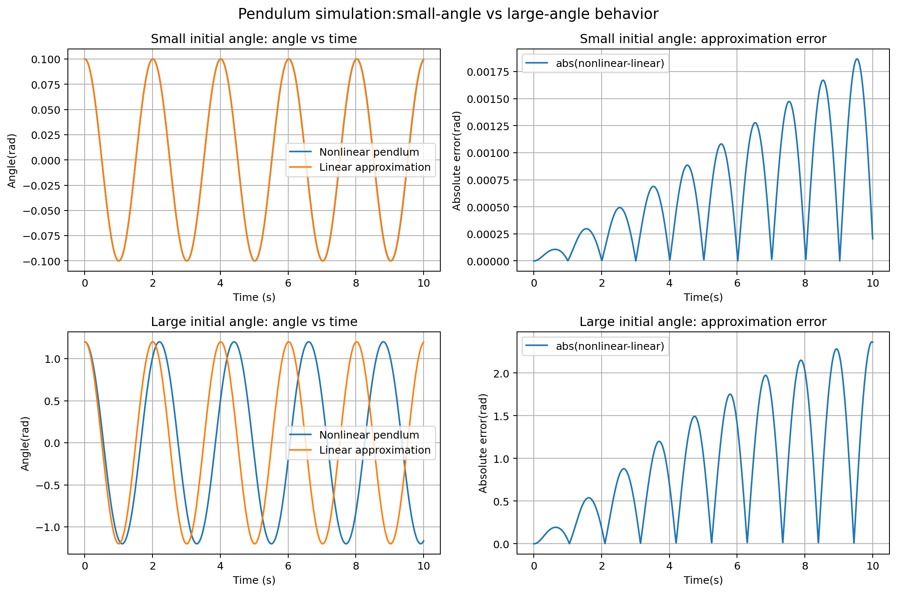
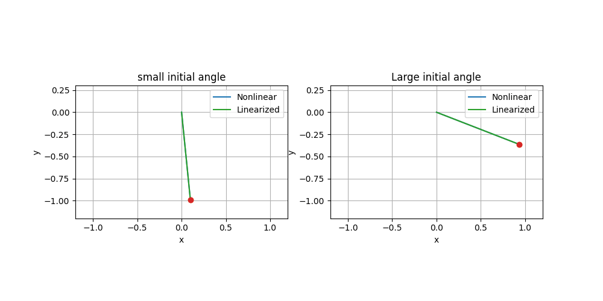
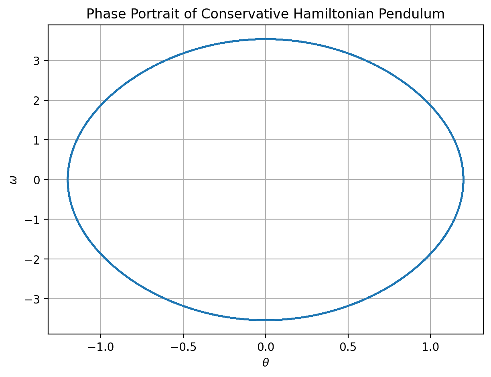
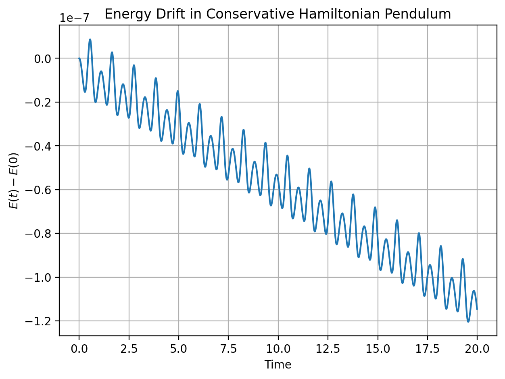
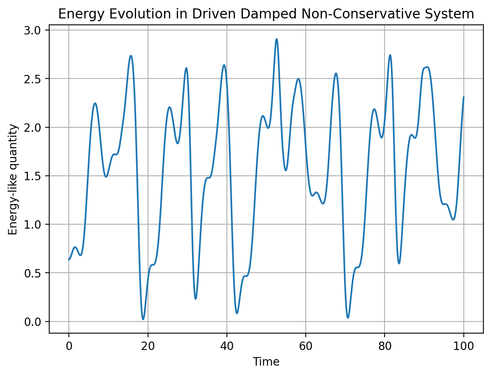
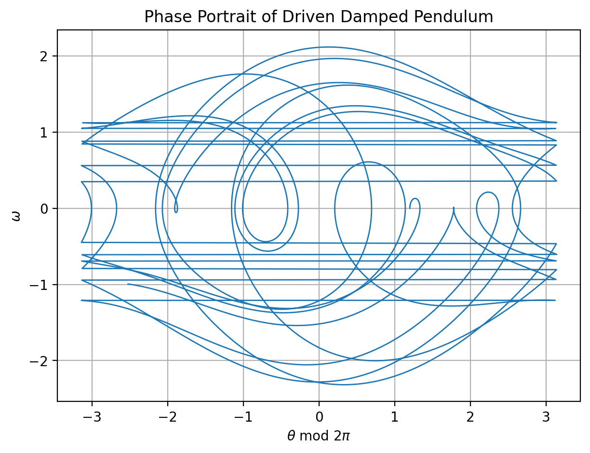
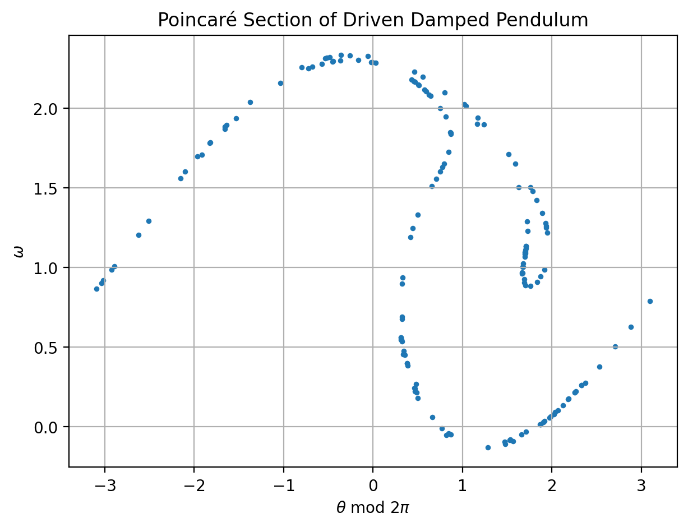
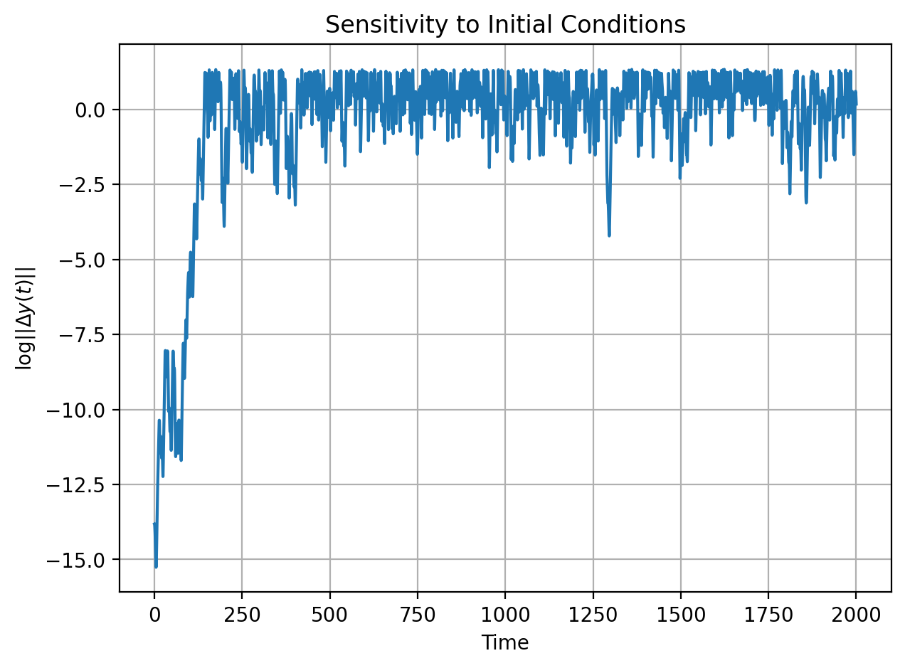

# Numerical Investigation of Nonlinear Pendulum Dynamics

## Overview

This project presents a research-style numerical investigation of nonlinear pendulum dynamics. It begins with the classical conservative Hamiltonian pendulum and then extends the model to a driven damped nonlinear pendulum in order to study complex long-term dynamics.

The project focuses on the connection between numerical analysis and nonlinear dynamical systems, including energy behavior, phase-space structure, sensitivity to initial conditions, and Poincaré-section-based diagnostics.

This repository is designed as a computational research portfolio project suitable for graduate school and PhD applications in applied mathematics, scientific computing, numerical analysis, and dynamical systems.

---

## Research Motivation

Many nonlinear systems do not admit simple closed-form solutions. Numerical simulation is therefore essential for understanding their trajectories, stability, qualitative behavior, and long-time dynamics.

The pendulum is a compact but mathematically rich model because it connects:

* ordinary differential equations
* nonlinear dynamics
* Hamiltonian systems
* energy conservation
* numerical time integration
* driven damped systems
* sensitivity to initial conditions
* Poincaré sections and chaos diagnostics

The goal of this project is not only to simulate pendulum motion, but also to analyze how numerical methods reveal qualitative properties of nonlinear dynamical systems.

---

## Mathematical Models


### Conservative Hamiltonian Pendulum

The classical nonlinear pendulum is governed by

$$
\theta'' + \frac{g}{L}\sin(\theta)=0.
$$

Introducing the angular velocity

$$
\omega = \theta',
$$

the second-order equation can be rewritten as the first-order system

$$
\begin{aligned}
\theta' &= \omega, \\
\omega' &= -\frac{g}{L}\sin(\theta).
\end{aligned}
$$

This conservative system has Hamiltonian energy

$$
E(\theta,\omega)
=
\frac{1}{2}mL^2\omega^2
+
mgL\left(1-\cos(\theta)\right).
$$

### Driven Damped Nonlinear Pendulum

To study more complex nonlinear behavior, the model is extended to a driven damped pendulum:

$$
\theta''
+
q\theta'
+
\sin(\theta)
=
b\cos(\Omega t).
$$

Introducing angular velocity

$$
\omega = \theta',
$$

the second-order equation can be rewritten as the first-order system

$$
\begin{aligned}
\theta' &= \omega, \\
\omega' &= -q\omega - \sin(\theta) + b\cos(\Omega t).
\end{aligned}
$$

This system is non-Hamiltonian because damping removes energy and external forcing injects energy.

---

## Numerical Method

The primary numerical method used is the fourth-order Runge-Kutta method. For a first-order system

$$
y' = f(t,y),
$$

RK4 updates the solution by

$$
y_{n+1}
=
y_n
+
\frac{h}{6}
\left(k_1 + 2k_2 + 2k_3 + k_4\right).
$$

The four intermediate slopes are defined as

$$
\begin{aligned}
k_1 &= f(t_n, y_n), \\
k_2 &= f\left(t_n+\frac{h}{2},\, y_n+\frac{h}{2}k_1\right), \\
k_3 &= f\left(t_n+\frac{h}{2},\, y_n+\frac{h}{2}k_2\right), \\
k_4 &= f(t_n+h,\, y_n+h k_3).
\end{aligned}
$$

Therefore, each time step uses a weighted average of four slope estimates:

$$
\frac{1}{6}
\left(k_1 + 2k_2 + 2k_3 + k_4\right).
$$

The method is used because it provides high accuracy for smooth ordinary differential equations while remaining straightforward to implement.

For the driven system, the RK4 method is implemented carefully using the correct time values:

- \(t_n\) for \(k_1\)
- \(t_n+\frac{h}{2}\) for \(k_2\)
- \(t_n+\frac{h}{2}\) for \(k_3\)
- \(t_n+h\) for \(k_4\)

This is important because the driven pendulum is explicitly time-dependent.

---

## Repository Structure

```text
Numerical-Investigation-of-a-Nonlinear-Pendulum/
│
├── README.md
├── requirements.txt
├── .gitignore
│
├── Nonlinear Dynamics.ipynb
├── pendulum.ipynb
│
├── figures/
│   ├── energy_drift.png
│   ├── hamiltonian_energy_drift.png
│   ├── hamiltonian_phase_portrait.png
│   ├── lyapunov_growth.png
│   ├── pendulum.gif
│   ├── phase_portrait.png
│   ├── poincare_section.png
│   ├── pendulum_simulation_comparison.gif
│   └── pendulum_small_vs_large_comparison.png
│
└── paper/
    ├── paper.md
    └── paper_outline.md
```

---

## Main Results

### 1. Small-Angle vs Large-Angle Behavior

The small-angle approximation agrees well with the nonlinear pendulum only when the initial angle is small. For larger amplitudes, the linear approximation deviates significantly from the nonlinear trajectory.


Relevant figures:





---

### 2. Conservative Hamiltonian Phase Portrait

The conservative Hamiltonian pendulum forms a closed orbit in phase space. This reflects periodic motion and near conservation of energy.


Relevant figure:


---

### 3. Hamiltonian Energy Drift

For the conservative pendulum, the numerical energy drift remains very small under RK4 over the simulated time interval. This confirms accurate short-to-medium time behavior.

Relevant figure:



Important note: RK4 is accurate but not exactly energy-preserving. It is not a symplectic integrator, so long-time Hamiltonian structure preservation would require further comparison with symplectic methods.

---

### 4. Driven Damped Energy Evolution

The driven damped system is non-conservative. Its energy-like quantity fluctuates over time because damping removes energy while external forcing injects energy.

Relevant figure:



---

### 5. Driven Damped Phase Portrait

The driven damped phase portrait shows a more complex long-time structure than the conservative system. This reflects the combined effects of nonlinearity, damping, and periodic forcing.

Relevant figure:



---

### 6. Poincaré Section

The Poincaré section samples the driven system once per driving period after discarding transient behavior. This reduces the continuous-time dynamics to a discrete map and provides insight into long-term nonlinear behavior.

Relevant figure:



The observed structure suggests complex dynamics beyond simple periodic motion. It should be interpreted as qualitative evidence of nontrivial nonlinear behavior rather than a rigorous proof of chaos.

---

### 7. Sensitivity to Initial Conditions

The sensitivity experiment compares two nearby trajectories in phase space. The rapid early growth of separation indicates sensitivity to initial conditions, followed by saturation due to bounded phase-space dynamics.

Relevant figure:



---

## Key Takeaways

* The small-angle approximation is valid only for small initial angles.
* The conservative nonlinear pendulum has closed phase-space orbits.
* RK4 produces very small short-to-medium time energy drift for the conservative system.
* The driven damped pendulum is non-Hamiltonian and exhibits complex long-term behavior.
* Poincaré sections provide a useful tool for visualizing nonlinear dynamics.
* Sensitivity to initial conditions provides qualitative evidence of complex dynamics.

---


## How to Reproduce

Install the required Python packages:

```bash
pip install -r requirements.txt
```

Run the complete reproducible script:

```bash
python main.py
```

This will regenerate the main simulation figures and save them in the `figures/` folder.

Alternatively, you can open the notebooks in VS Code or Jupyter:

```bash
jupyter notebook
```

Recommended notebook: `Nonlinear_Dynamics.ipynb`

All generated figures are saved in the `figures/` folder.
---

## Dependencies

* Python 3.10+
* NumPy
* Matplotlib
* Pillow
* Jupyter

---

## Research Relevance

This project demonstrates the intersection of numerical analysis and nonlinear dynamical systems. It is intended as a research-style computational project for academic portfolios and graduate applications.

The project shows not only how to simulate a nonlinear system, but also how to analyze qualitative behavior through energy diagnostics, phase portraits, sensitivity experiments, and Poincaré sections.

---

## Possible Future Work

Potential extensions include:

* Comparing RK4 with symplectic integrators such as Velocity Verlet
* Computing a rigorous Lyapunov exponent
* Generating bifurcation diagrams over driving amplitude
* Studying long-time Hamiltonian structure preservation
* Extending the analysis to Duffing oscillators or coupled nonlinear systems
